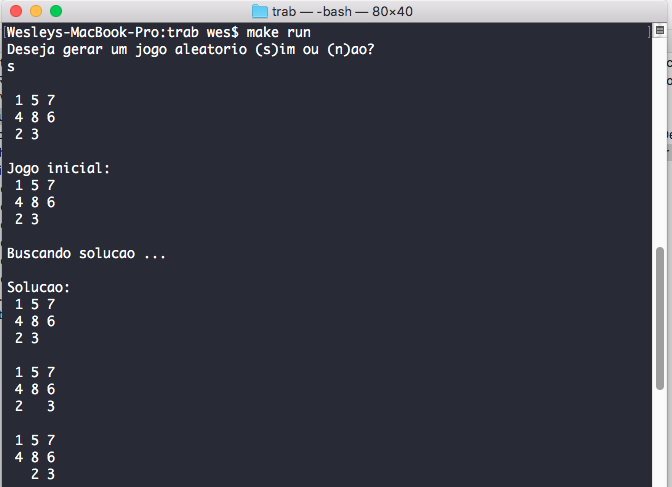
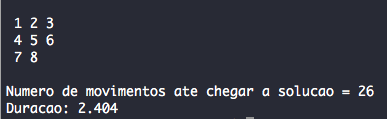

# 8-puzzle




OVERVIEW
--------------------------------------------------
This is an implementation of an 8-puzzle game solver for the [Artificial Intelligence] course. The purpose of this project was to implement and compare informed and non-uniformed search algorithms. The algorithms used in this project are A* and Breadth First Search.  It was made at the Computer Science course from University of São Paulo (ICMC - USP).

HOW TO COMPILE 
--------------------------------------------------

Clone 8puzzle repository:

```bash
  $ git clone https://github.com/wesjrock/8puzzle.git
```

Compiling: 

```bash
  $ gcc bfs8puzzle.c -o executable_name
  $ gcc astar8puzzle.c -o executable_name
```

HOW TO USE 
--------------------------------------------------

```bash
  When you run `bfs8puzzle` or `astar8puzzle`, the program will ask you:
  Do you want to use a random board? (y/n)
  Just answer yes or no and the program will give you the step by step solution plus the time it took to solve the board.
```

MORE INFO
--------------------------------------------------

You can find more information about it in the files:  `task specification.pdf` and `assignment report.pdf`

* 15-Puzzle <https://en.wikipedia.org/wiki/15_puzzle>
